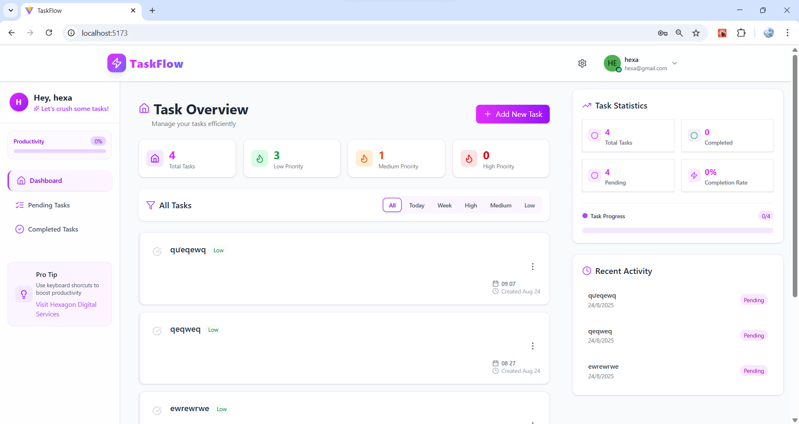
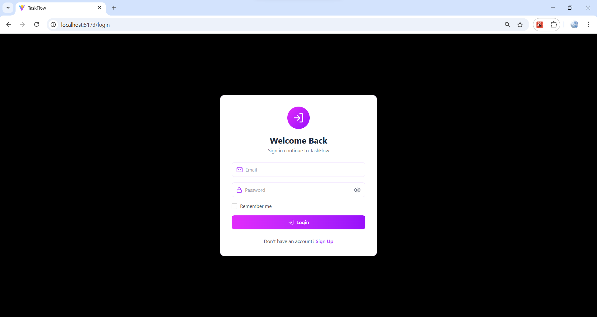
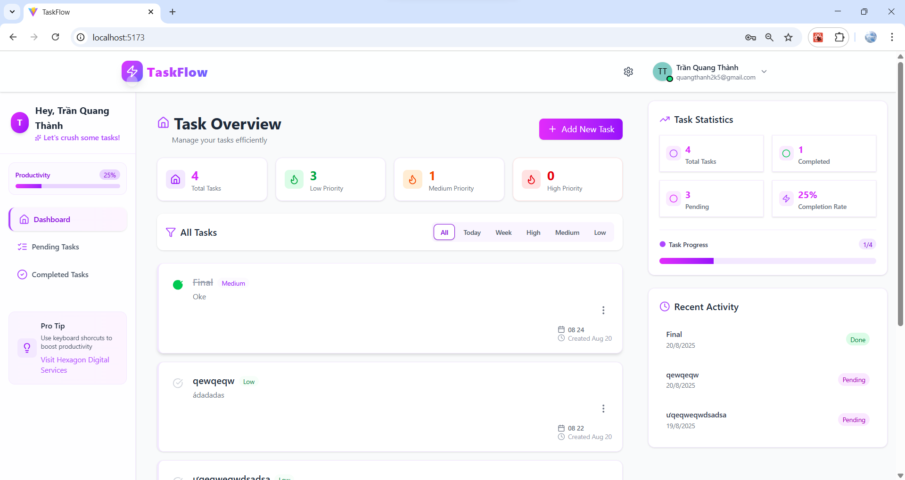
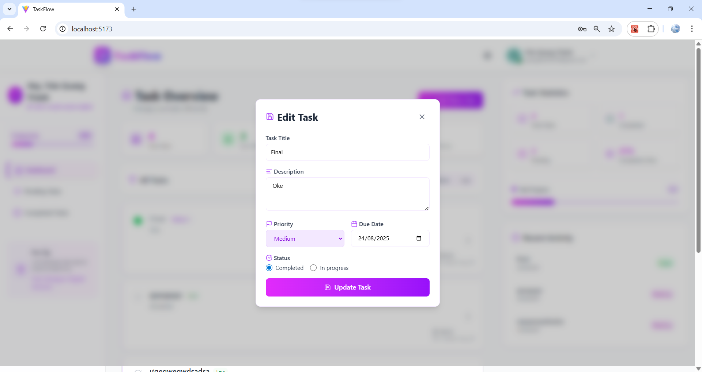

# TaskFlow - Task Management Application

## Overview
TaskFlow is a modern task management application designed to help users organize and track their daily tasks efficiently. It provides a secure and user-friendly interface for managing personal and professional tasks with authentication features.

## Key Features
- 👤 User Authentication (Register/Login)
- ✅ Create, Read, Update, Delete tasks
- 🔒 Secure API with JWT Authentication
- 📱 Responsive design
- 📊 Task status tracking
- 🏷️ Task categorization



## Tech Stack
### Backend
- Node.js
- Express.js
- MongoDB
- JWT for authentication

### Frontend (if applicable)
- React.js
- Material-UI/Tailwind CSS
- Axios for API calls

## Prerequisites
- Node.js (v14 or higher)
- MongoDB
- npm or yarn

## Installation Guide

### Backend Setup
1. Clone the repository:
   git clone https://github.com/tsunflowerr/Task-Manager.git

2. Navigate to backend directory and initialize project:
   ```bash
   cd backend
   npm init
   ```
3. Install backend dependencies:
   ```bash
   npm install express mongoose nodemon validator jsonwebtoken cors dotenv body-parser bcrypt bcryptjs
   ```
   Dependencies explanation:
   - `express`: Web application framework
   - `mongoose`: MongoDB object modeling tool
   - `nodemon`: Auto-reloads server during development
   - `validator`: Data validation library
   - `jsonwebtoken`: JWT authentication
   - `cors`: Enable Cross-Origin Resource Sharing
   - `dotenv`: Environment variables management
   - `body-parser`: Request body parsing
   - `bcrypt/bcryptjs`: Password hashing

4. Create `.env` file in the backend directory:
   ```env
   MONGODB_URI=your_mongodb_uri
   ```

5. Start the server:
   ```bash
   npm start
   ```

### Frontend Setup
1. Navigate to frontend directory:
   ```bash
   cd ../frontend
   ```
2. Install core dependencies:
   ```bash
   npm install
   ```

3. Install additional frontend dependencies:
   ```bash
   npm install tailwindcss @tailwindcss/vite
   npm install react-router-dom
   npm install react-toastify
   ```
   Dependencies explanation:
   - `tailwindcss`: Utility-first CSS framework
   - `@tailwindcss/vite`: Tailwind CSS integration with Vite
   - `react-router-dom`: Routing for React applications
   - `react-toastify`: Toast notifications

4. Start the development server:
   ```bash
   npm run dev
   ```

The application will be available at `http://localhost:5173`


## API Endpoints

### Authentication
- `POST /api/users/register` - Register new user
- `POST /api/users/login` - User login

### Tasks
- `GET /api/tasks` - Get all tasks
- `POST /api/tasks` - Create new task
- `PUT /api/tasks/:id` - Update task
- `DELETE /api/tasks/:id` - Delete task

## Application
> - Login/Register page

> - Task Dashboard

> - Edit Task Modal


---
Made with ❤️ by tsunflowerr